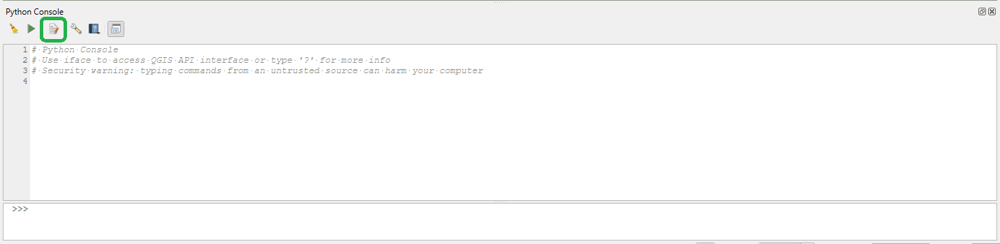
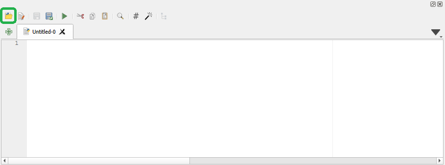
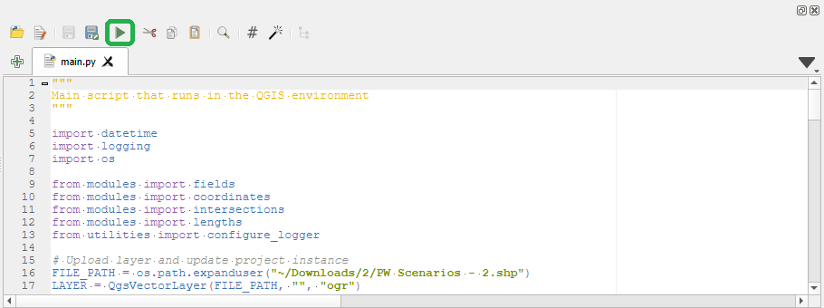

# PyQGIS shapefile validation

## Installation Requirements

This script runs in the QGIS environment - install QGIS at https://www.qgis.org/en/site/forusers/download.html

This repository can be cloned into any directory

## Running the Script

Open `config.txt` with a text editor, replace the example text with the path to the shapefile (note that it must be the absolute path), ensure that the entire text file is 1 line

Run QGIS and click on the python icon, a console should appear

Click on the editor icon

Click on the file explorer icon

In the file explorer, navigate to this repository and open `main.py`
Click on the run button

## Using the Output

This script will log all warnings and errors to the console, and all debug logs to a log file in the `logs` directory - the name of the logfile will be the timestamp of when the script was run

The script will also output the feedback message for these warnings and errors to the console and a text file in the `feedback` directory (name is also the timestamp) as per the [Public Works: Route Shapefile Validation (Partner Guide) \[PUB\]
](https://docs.google.com/document/d/1PRAwFHVcfzmP5Um6crQzm4FY151ZIkIZxw5yzwEOYb4/)

## Using the Utilities

A couple of utilities are used for debugging purposes and do not need to be run to resolve a ticket
Note that these utilites must be run in the PyQGIS environment (see instructions above to open these scripts in the PyQGIS editor)

`zoom_to_feature.py` will refresh the view window to the feature - to use this script, edit `feature_id` to be the feature you wish to zoom in on

`draw_line.py` will draw a line on the shapefile - edit the attributes and geometry and run the script
note that this does edit the shapefile, so it's best to make a copy and run it on that
